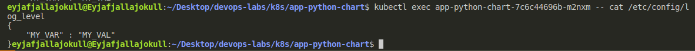

# Lab 12

## 10 points

After running `kubectl exec app-python-chart-7c6c44696b-m2nxm -- cat /etc/config/log_level`, I got the following output:

## References

- Mount a ConfigMap - [docs](https://kubernetes.io/docs/concepts/storage/volumes/#configmap)
