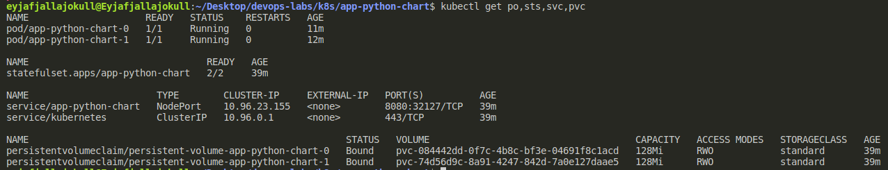
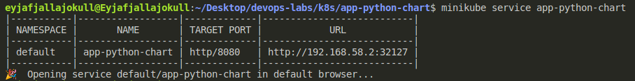
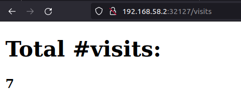
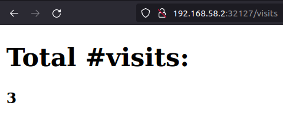
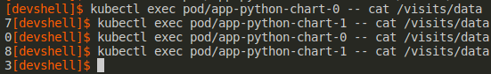

# Lab 13

## 1-3

I had to disable `livenessProbe`, `readinessProbe` to let pods run.

Browser tabs of both replicas:

As each replica has its own volume, the numbers are different.
Here's how the contents of files in their volumes change as I visit `/` of my site:

## 4

We don't need any ordering as our replicas are identical and don't share state.
To run pods in parallel, I set `spec.podManagementPolicy: "Parallel"` in `statefulset.yaml`.