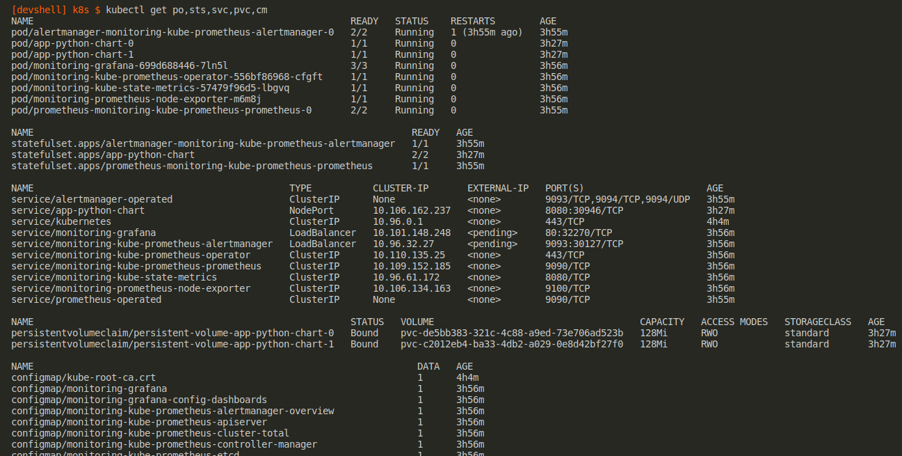
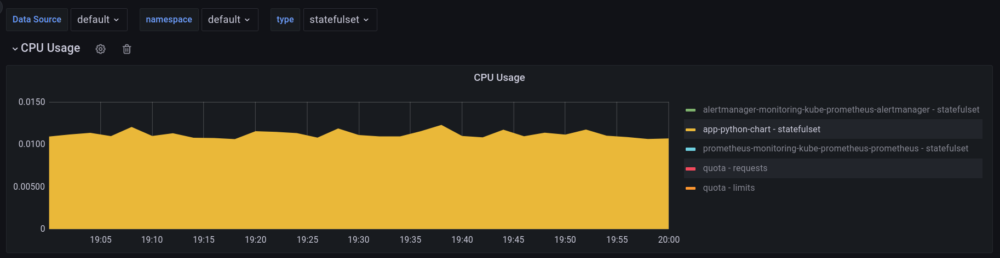
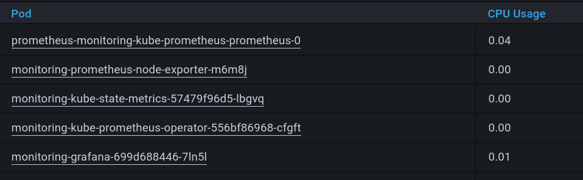
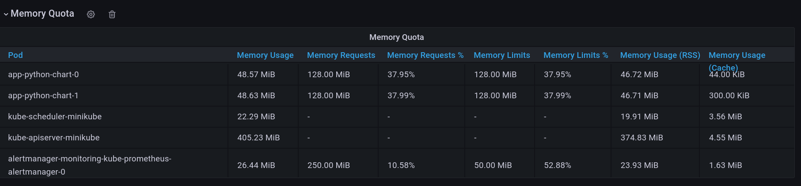
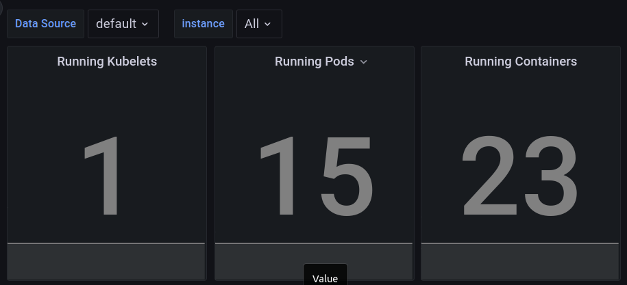
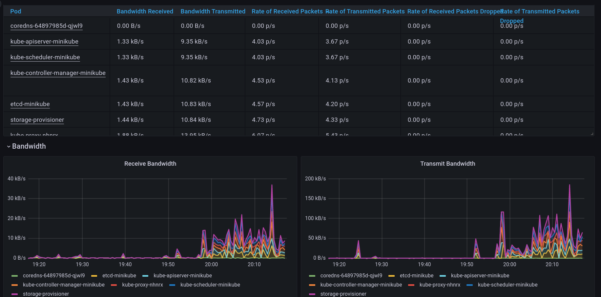
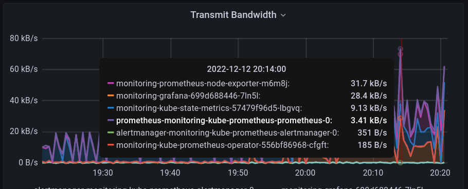
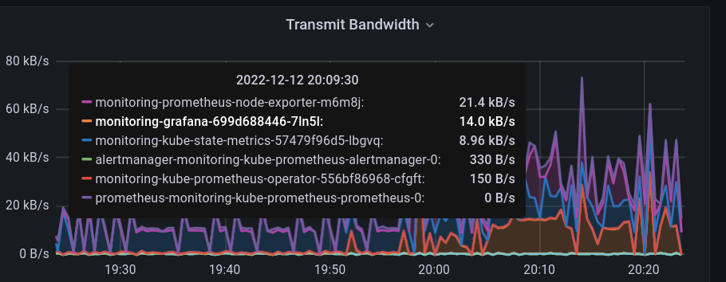
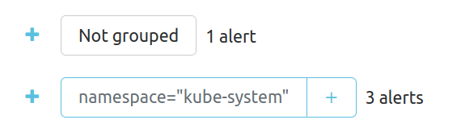
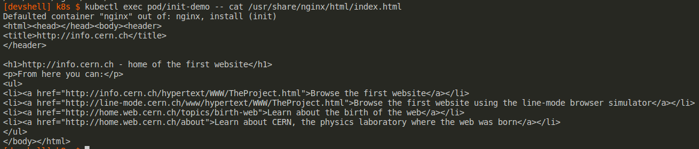

# Lab 14

Kudos to [@Markovvn1](https://github.com/Markovvn1)

## 1-2

- **Prometheus Operator** - simplify deployment of Prometheus - related tools on Kubernetes clusters
- **Prometheus** -  A monitoring and metrics tool with dashboards and other features
- **Alertmanager** - Collect, process, and route alerts from monitoring systems to receivers
- **Prometheus node-exporter** - An exporter for Prometheus that collects metrics about a host
- **Prometheus Adapter for Kubernetes Metrics APIs** - implementation of Kubernetes APIs of resource, custom, external metrics
- **kube-state-metrics** - Generate metrics about objects the state of Kubernetes objects
- **Grafana** - Handle metrics, logs, and traces

## 3

`kubectl get po,sts,svc,pvc,cm` - display resources:

- `po` - pods
- `sts` - statefulsets
- `svc` - services
- `pvc` - persistentvolumeclaims
- `cm` - configmaps

The complete list: `kubectl api-resources`

## 4

1. Check how much CPU and Memory your StatefulSet is consuming.
    
1. Check which Pod is using CPU more than others and which is less in the default namespace.
    
1. Check how much memory is used on your node, in % and mb.
    
1. Check how many pods and containers actually ran by the Kubelet service.
    
1. Check which Pod is using network more than others and which is less in the default namespace.
    
1. Check which Pod is using network more than others and which is less in the default namespace.
    `...-node-exporter-...` uses Transmit Bandwidth the most
    
   `prometheus-monitoring-kube-...` uses Transmit Bandwidth the least
    
1. Check how many alerts you have. Also you can see them in the Web UI by the `minikube service monitoring-kube-prometheus-alertmanager` command.
    

## 5

`kubectl apply -f init_container/deployment.yaml`

